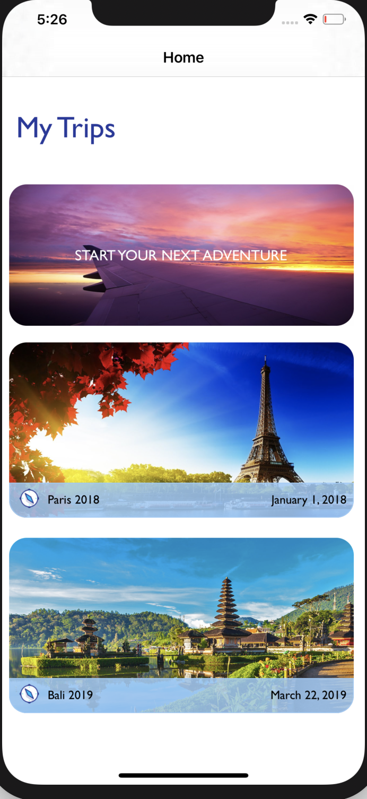
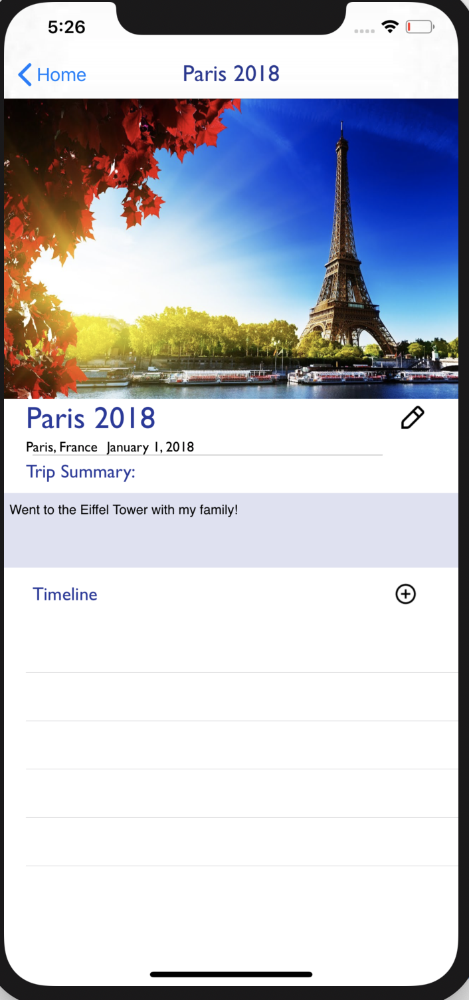
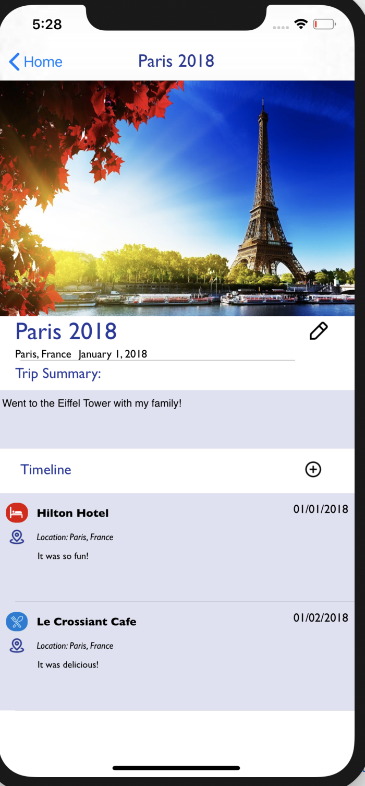
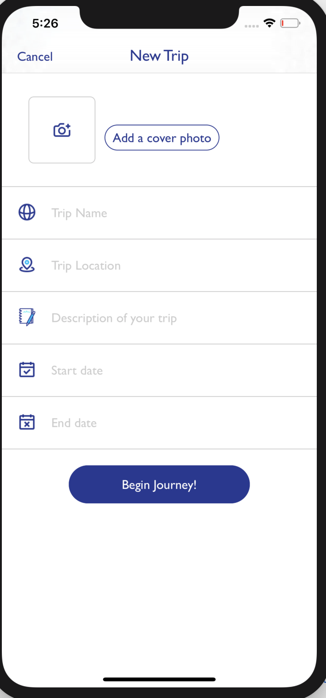
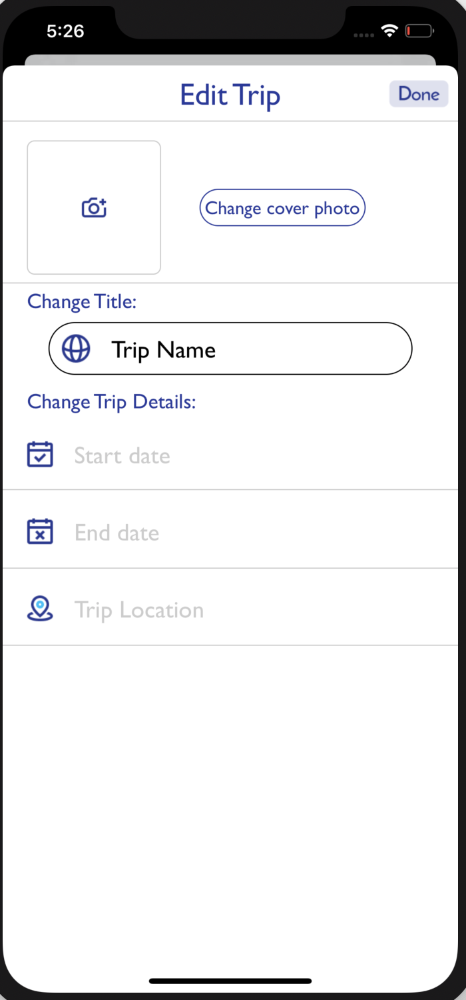

# Wander
Wander is an app to that allows users to commemorate their past
adventures and plan future trips using Swift.

App Description: Our app allows users to keep track of all of their trips.
The home screen displays all of their past trips and an option to add a new trip. Within each trip, information regarding the trip (trip dates, summary, description, and a timeline with their activities during their trip, etc.).

Contributions:
Sophia Xu: iOS
Miah Sanchez: iOS
Robel Ayalew: Backend
Tony Bridges: Design

Link to Robel Ayalew's Backend: https://github.com/Robelion/Travel-Journal-Backend

Screenshots of App:

iOS Features:
- AutoLayout using SnapKit and NSLayoutConstraint
- UICollectionView: collection of trips, category options
- UITableView: timeline of trips
- UINavigationController: options to change screens to edit trip, add trip, add to timeline, and view more information about a trip.
- Integration with an API: NetworkManager is set up and ready for future potential integration.

<!-- Link to Screenshot Photos : https://github.com/sophiaxu-code/traveljournal/issues/1 -->
# wander
